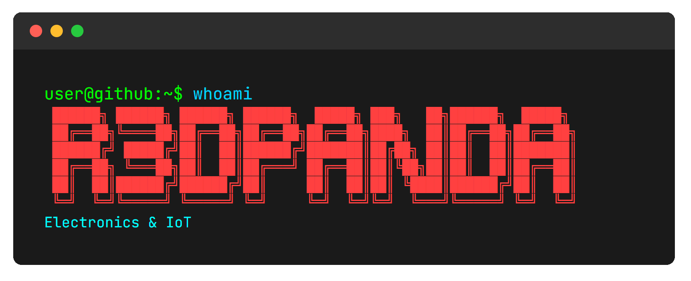

Electronics & IoT developer. Building embedded projects, IoT connected devices, and some app development.

---

**Tech Stack**

`C++` `Python` `JavaScript` `HTML/CSS` `Kotlin\Swift\Dart` `Go`

**Electronics & Platforms**

`ESP23` `STM32` `Arduino` `Raspberry Pi`

**Protocols**

`REST` `MQTT` `LoRaWAN` `OneM2M`

**Other**

3D Printing & CAD Design [MakerWorld Profile](https://makerworld.com/de/@R3DPanda)

---
